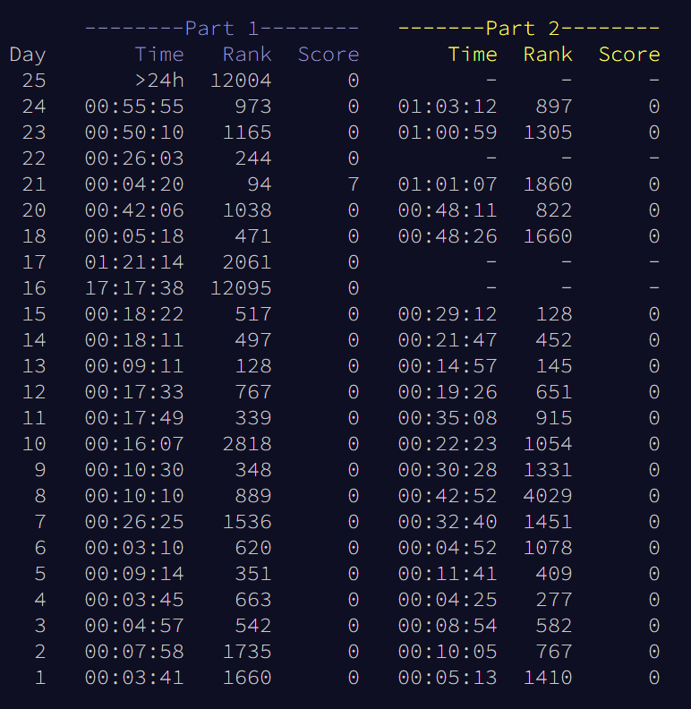

# Advent of Code 2022
## RobertJN64 Solutions

All solutions were written with no assistance from forums.
Solutions are not necessarily optimal - but many use interesting
techniques.

The repo also contains the template file I used, as well as the scripts
to launch each part quickly.

Summary:

 - All puzzles were completed in under 24 hours except for day 25 because of family conflicts around Christmas
 - Top 100 on Day 21
 - Top 500 many days, top 1000 most days
 - Day 19 - neither part solved - solution not fast enough
 - Day 16 - only part A - solution not fast enough
 - Day 17 - only part A - too lazy to figure out the caching
 - Day 22 - only part A - too lazy to work out the 3D rotations
 - Day 25 is only one part

Thoughts on Puzzles:
 - 1 - 6 - good introductory puzzles
 - 7 (storage space) - recursion + some interesting data structures
 - 8 (tree heights) confusing wording (or I was tired)
 - 9 (ropes) - tricky but fun
 - 10 (CRT display) - off by one errors...
 - 11 (Monkeys) - first real optimization with LCM
 - 12 (Maze) - standard maze solve alg
 - 13 (Sorting) - fun with python magic methods leads to top 150!
 - 14, 23 - both decent simulation problems, no real optimization needed
 - 15 (Beacons) - First serious optimization problem, I missed the best trick but my code finds all possible solutions
 - 16 (Valves) - First brutal problem, earlier than last year. Improved my part A solution from 100 to 0.01 seconds, but still not fast enough for part B
 - 17 (Tetris) - Needed caching, too lazy to write it
 - 18 (Surface Area) - Over optimized this one after the previous 2 days
 - 19 (Blueprints) - Brutally slow - I didn't figure out the correct pruning method
 - 20 (Mixing Numbers) - Wrote a "optimal" solution that was slower than python std lib
 - 21 (Monkey Math) \[Top 100] - fun with python eval
 - 22 (Cube Maze) - Best puzzle IMO - too bad the optimal solution was hardcoding
 - 24 (Blizzard Maze) - Fun maze solver with some cool optimization tricks
 - 25 (-=012 Numbers) - First part was easy, generating the numbers was hard because I'm bad at math apparently

Overall - better score than AoC 2021 (44 instead of 43). I doubt I'll come back to any of the puzzles, maybe 19a to optimize
or 22b to finish. To improve from here, I need to learn a few more dynamic programming techniques, and get more
proficient with parsing in C++ for the slow days.